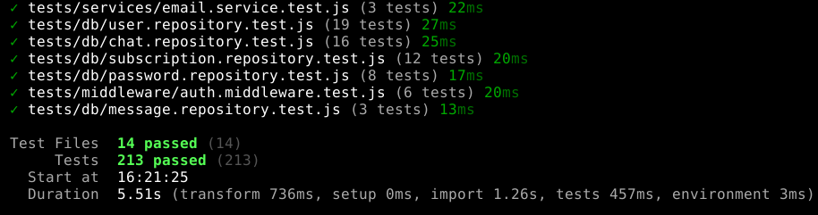
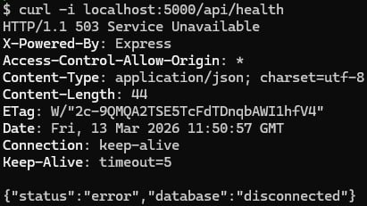
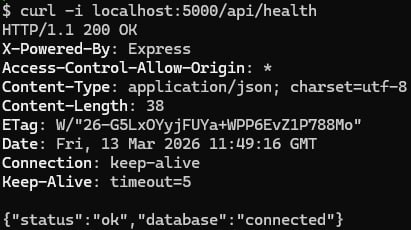
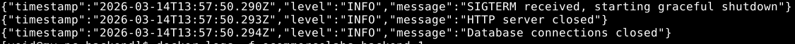

Щоб запустити проект достатьно у корні проекту прописати (це запустить продакшен версію проекту)  
```
docker-compose -f docker-compose.prod.yml up --build
```
Запустити тести
```
cd backend
```
```
npm test
```
  
Health check  
  
  
Структуроване логування в JSON (також у цих логах видно graceful shutdown)  

